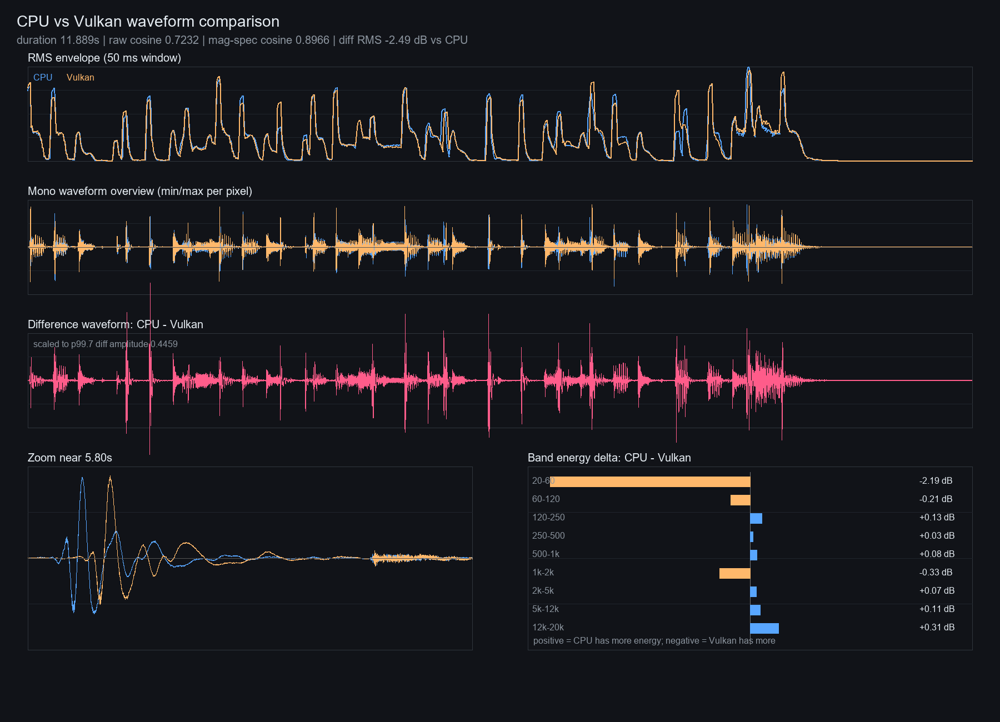

# vulkan backend

the ggml vulkan backend runs the whole sa3 stack (t5gemma + dit + same decoder) with
**zero custom ops and zero graph changes** — same payoff as cuda, the vanilla-ggml port
just lights up another backend. validated 2026-06-27 on a 5070 laptop (8gb).

## setup (5070 laptop, windows)

the runtime/driver is enough to *run* a vulkan build, but *building* ggml-vulkan needs the
vulkan sdk (headers, `vulkan-1.lib`, and `glslc` to compile the compute shaders into spir-v).

```powershell
# 1. install the sdk — note the winget id is KhronosGroup, NOT LunarG
winget install -e --id KhronosGroup.VulkanSDK
#    lands at C:\VulkanSDK\<version>\  (e.g. 1.4.350.0), glslc in Bin\

# 2. point cmake at the sdk for the CONFIGURE step (a fresh shell after install also works)
$env:VULKAN_SDK = "C:/VulkanSDK/1.4.350.0"
$env:PATH = "C:/VulkanSDK/1.4.350.0/Bin;$env:PATH"

# 3. configure a separate build dir (keeps the cpu/cuda builds intact)
cmake -S . -B build-vulkan -G "Visual Studio 17 2022" -A x64 -DSA3_VULKAN=ON
#    look for "-- Including Vulkan backend" in the output

# 4. build (first build is slow — it compiles every shader into a ~48mb ggml-vulkan.dll)
cmake --build build-vulkan --config Release --target sa3-generate
```

running the resulting binary only needs the gpu driver (the loader), not the sdk env.

## device selection (multi-gpu)

vulkan registers **every** device, so on a laptop with an intel igpu *and* the discrete
nvidia, both show up:

```
ggml_vulkan: Found 2 Vulkan devices:
ggml_vulkan: 0 = Intel(R) Graphics ...
ggml_vulkan: 1 = NVIDIA GeForce RTX 5070 Laptop GPU ... | matrix cores: NV_coopmat2
[sa3] backend: Vulkan1 (NVIDIA GeForce RTX 5070 Laptop GPU, 7.7 GB)
```

`make_backend` (src/gguf_model.h) enumerates all gpu devices and defaults to the one with
the most vram (the discrete gpu) — a naive first-by-type pick could land on the igpu.
override it with `SA3_GPU`:

- `SA3_GPU=1` — by 0-based index into the gpu list
- `SA3_GPU=nvidia` — by case-insensitive substring of the device name

`SA3_DEVICE=cpu` still forces the cpu backend for a/b. single-gpu cuda/cpu builds are
unaffected (the new logic only branches when there's more than one gpu).

## speed

medium f16, 8 steps, ~12s output, end-to-end wall time including model load:

| backend | total |
|---|---|
| vulkan (5070, f16) | ~4.1 s |
| cuda (5070, f16)   | ~3.5 s |

in the same ballpark as cuda. f16 is the production path — **f32 medium (10.3gb) does not
fit in 8gb under vulkan**: the allocator hard-fails (`ErrorOutOfDeviceMemory`) rather than
paging over pcie like cuda does, so use the f16 ggufs on an 8gb card.

## numerical parity — read this before trusting raw cosine

the per-op parity vs the cpu backend is excellent, but **end-to-end generation only hits
raw waveform cosine 0.72 vs cpu**, and that number is misleading. here's the whole story.

isolated forward passes, vulkan vs cpu:

| stage | f16 | f32 |
|---|---|---|
| dit single forward | 0.99992 | 0.99993 |
| same-l decode      | 0.99974 | 0.99974 |

f16 and f32 match, so it's **not** an f16-accumulation thing. the source is nvidia's
**coopmat2 (tensor-core) matmul accumulation**. force the scalar path and it's bit-exact:

| dit forward (f32, vk vs cpu) | cosine | maxdiff |
|---|---|---|
| coopmat2 on (default) | 0.99993 | 0.048 |
| coopmat2 off | 0.99999 | 0.011 |
| all-scalar (`GGML_VK_DISABLE_F16/COOPMAT/COOPMAT2`) | **1.0000000** | 0.00003 |

so the backend is **correct**. that ~1e-4 tensor-core gap then compounds through the
chaotic 8-step ping-pong sampler into a *different-but-valid* sample — the same class as
the cross-device seed non-parity we already don't chase. vulkan is also deterministic
run-to-run (cosine 1.0, no atomic nondeterminism), it just doesn't match the cpu trajectory.

**precise-mode lever:** `GGML_VK_DISABLE_F16=1 GGML_VK_DISABLE_COOPMAT=1
GGML_VK_DISABLE_COOPMAT2=1` brings full-gen back to cpu (0.999 with f16 weights; exact with
f32 — which won't fit on 8gb). slower, only useful for numerical validation, not production.

## does it actually sound different?

no. on laptop speakers the default-coopmat vulkan output and the cpu output are effectively
identical. the 0.72 raw cosine is punishing fine waveform realization (transient shape,
phase texture, local hf detail), not the musical content — the rms envelope overlays almost
perfectly and the spectrogram-magnitude similarity is much higher (log-mag cosine 0.95).



the picture: rms envelopes (top) track tightly; the divergence lives in the per-sample
waveform and spikes at transient attacks (the difference waveform and the 5.8s zoom). band
energy is within a fraction of a db everywhere except a +2.2db sub bump (20-60hz) on vulkan.

### the codex-planation

> *(machine-written analysis — kept verbatim because it frames the right way to think about
> backend audio parity, not because it reflects anyone's hand-measured expertise here.)*
>
> So the .72 cosine is real, but it's mostly punishing sample/phase/transient shape, not the
> musical envelope. The RMS envelope overlays very closely, and the spectrogram magnitude
> similarity is much higher, which explains "sounds almost identical."
>
> **What changed:**
> - No alignment issue: best lag is 0 samples.
> - Vulkan is slightly hotter: +0.15 dB RMS, true peak -0.06 dBFS vs CPU -0.24 dBFS.
> - Vulkan has more low/sub energy: CPU minus Vulkan is -2.19 dB in 20-60 Hz.
> - CPU is a hair brighter/wider: slightly more 2k-12k, 12k-20k, and slightly more side energy.
> - Differences spike around transients: attacks where the waveform shapes diverge a lot
>   while the broader envelope stays similar.
>
> **The null is not small** — raw diff RMS -24.07 dBFS, -2.49 dB relative to CPU,
> -3.22 dB level-matched. They are *not* numerically close in waveform space. But for
> generated audio a lot of that is fine waveform realization: transient polarity/shape,
> phase-ish texture, local high-frequency detail. The output can be musically "same enough"
> while still being a bad raw sample-cosine match.
>
> My read: the Vulkan backend is not bit/precision-equivalent, but it's perceptually close
> for this sample. For backend validation, track both — raw cosine/null for numerical drift,
> and log-mag spectrogram/envelope metrics for "does it actually sound the same?" The latter
> agrees with the ears much better here.

the takeaway for our validation: **raw waveform cosine is the wrong end-to-end metric for a
backend whose matmuls aren't bit-exact.** use it on isolated forwards (where it correctly
reads ~1.0), and use envelope / log-mag-spectrogram similarity for the full generation.

full metrics: [docs/data/vulkan_cpu_audio_metrics.json](data/vulkan_cpu_audio_metrics.json).
a/b clips were `cppout/cpu_funk.wav` vs `cppout/vulkan_funk.wav` (prompt "upbeat funk groove
with slap bass", seed 0, f16, 128 frames).
